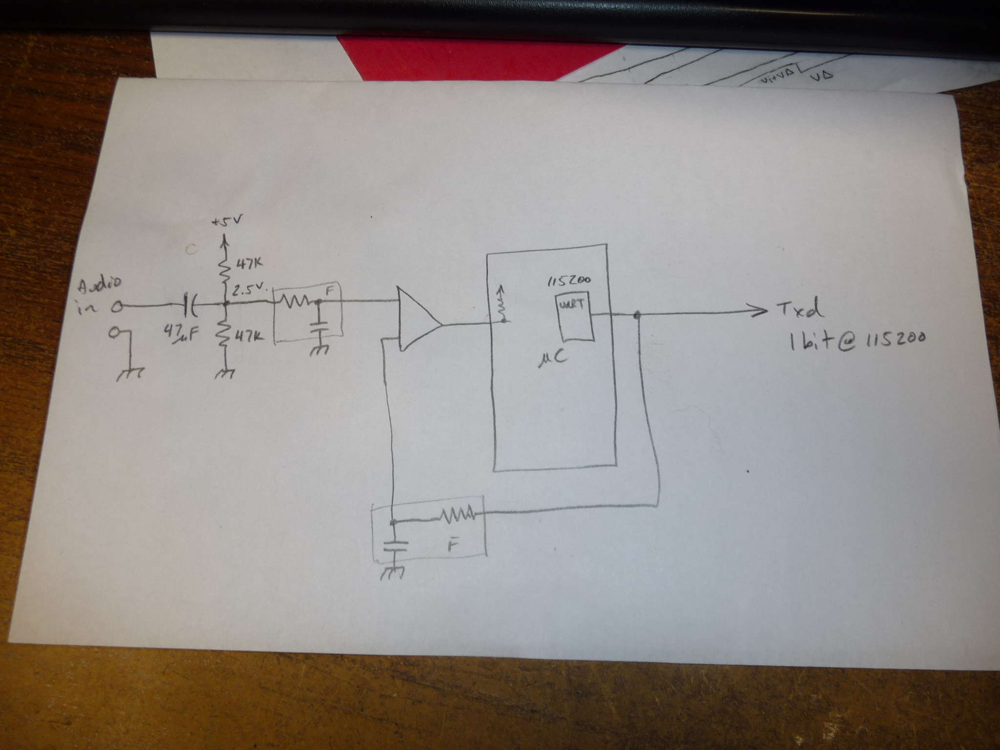
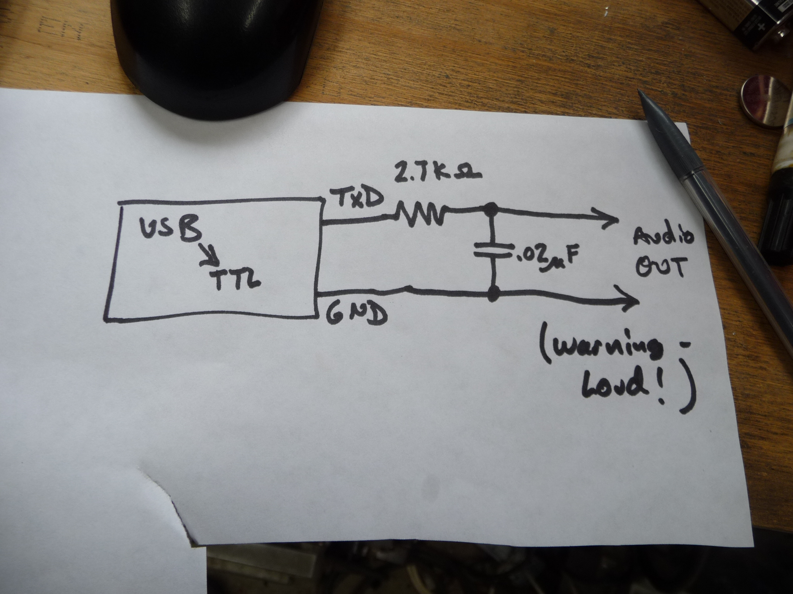
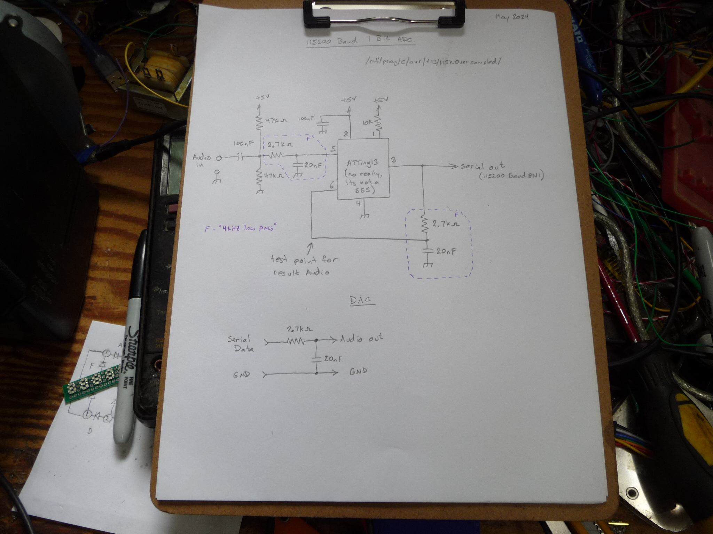
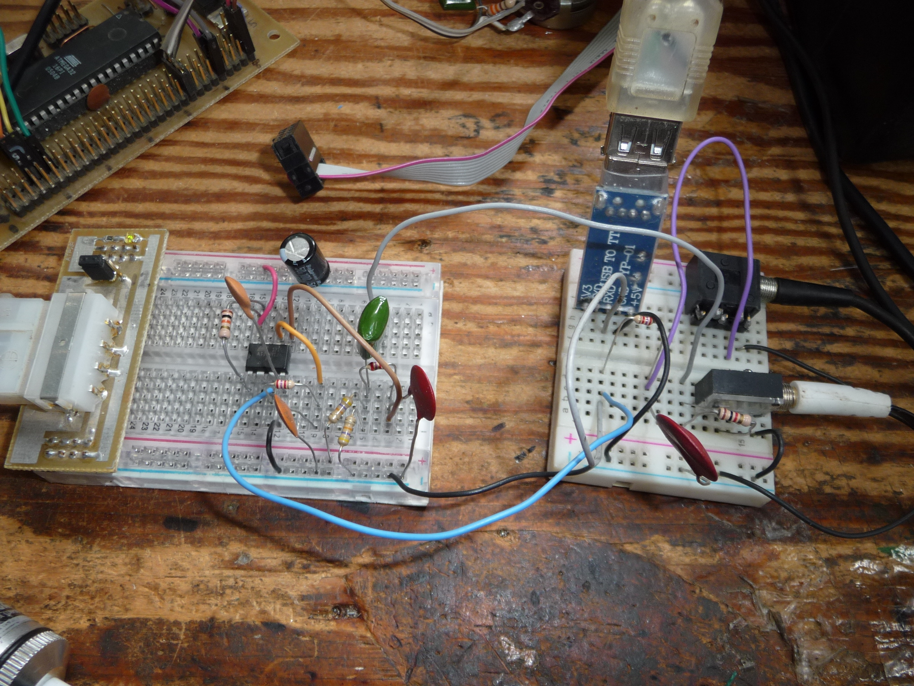
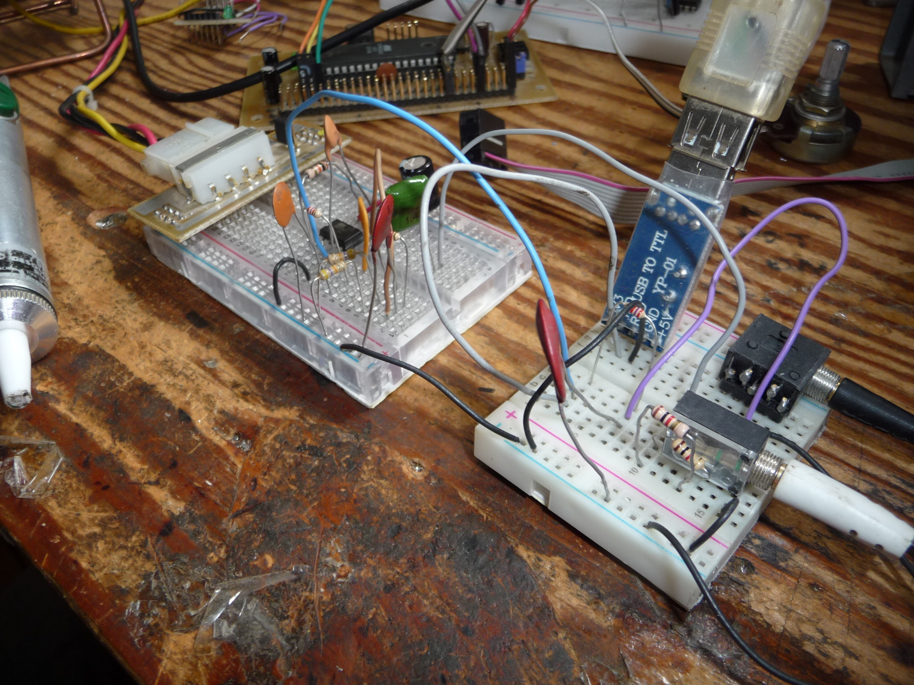
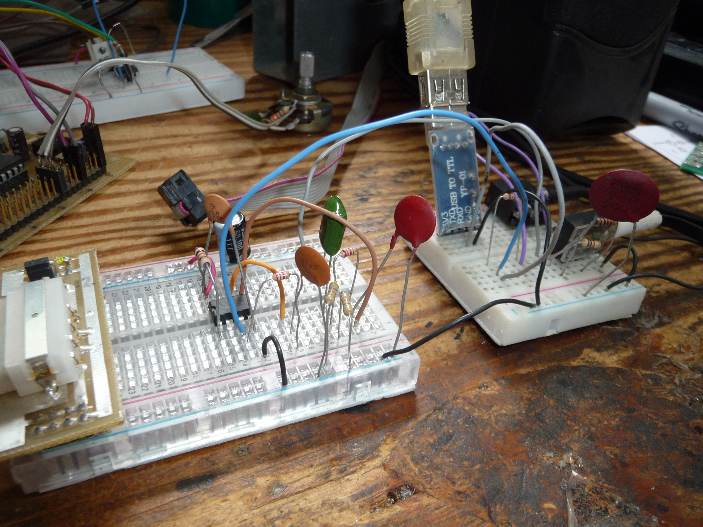
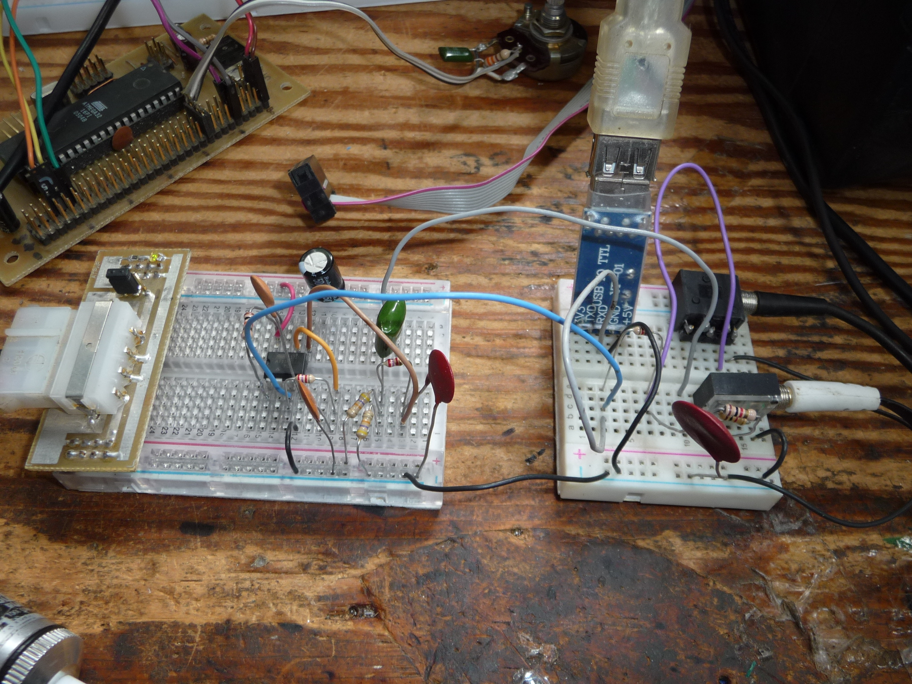

# 115kaudio
1 bit ADC that frames result as serial data. Play the audio with a lowpass on TxD.

"OMG it ****ing works"

credits to @LOOKMUMNOCMPUTR for the song, I think its halariously ironic to do this with 
his work, given the nature of how it was built. (I didn't ask, so, if your there, tell me if you need a takedown, 
I should hope your cool given the nature of this hack, this is the first 8N1 1 bit audio stream ever made, cause nobody was stupid enough to try it yet :] )

I will be posting the circuit that built the audio data stream. which is just a tiny13 and a few RC filters.

This is the concept, I used the comparitor in the tiny13, and not the uart, as you need to realtime output the bits.

To regenerate the audio you just need to recreate the lowpass that the ADC used.

Be aware that the levels comming out of this are 3V, which is REALLY hot for an audio signal, you will want to make sure that either the volume of what you play it to is quite far down, or that you use a voltage divider to scale it a bit.

I'm on linux,
I use minicom to set the baud rate of the port to 115200 8N1,
then the binary can just be cat'd to the port

cat song.bin > /dev/ttyUSB1

----------------------

ENCODER:

The schematic is quite simple, the only reason I used a microcontroller was to knock out the start and stop bits for me.
The input is rebiased at 2.5V, be aware it needs to be pretty hot, like 4Vp-p.
The input is then low-pass filtered just to be fair to the converter.
The serial output is low pass filtered and fed back to the compator to try to compensate the audio value for.

-- Build refrence images --

FIRMWARE:
  I have the makefile that I use on my debain linux machines in there, if your sadistic, you might be able to compile it with arduino.
  
  I have included the .hex file, cause not all of us are into compiling, and you know what? thats OK.

DECODER:

All thats needed to decode the stream is the RC filter that was used on the feedback for the comparator.
In this case a 2.7k resistor and 0.02uF capacitor. (THATS IT!)
Be aware that the audio levels comming out of it are pretty hot and might need to be divided down a bit. (to like 25%)

GEEK OUT!

Rue
